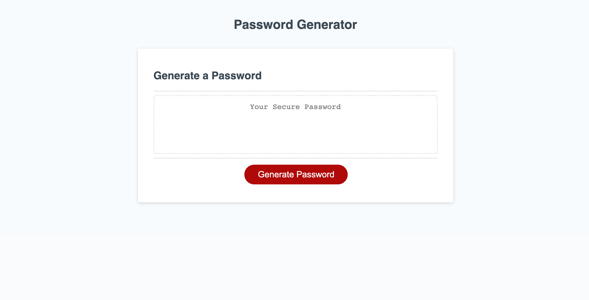

#Password Generator

## Description
This is the third homework assignment from the Johns Hopkins Coding Bootcamp. The objective is to create a randomly generated password depending on user input. The application will first ask for the desired password length. It will then prompt for lowercase, uppercase, numbers and finally special characters. 

The randomly generated password will display in the textarea on the page.

#Link to Site
[Click Here ](https://webdev410.github.io/homework-3/)

## Screenshot

##Technologies Used
* HTML
* CSS
* Javascript

##Developer Contact Info
webdev410@gmail.com
